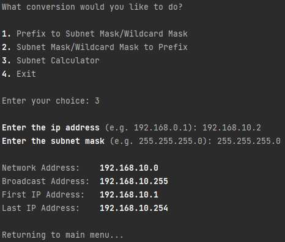

# Network Calculator
## Features

- Prefix to subnet and wildcard mask converter
- Subnet or wildcard to prefix converter
- Subnet calculations from ip and subnet mask to:
  - Network address
  - Broadcast address
  - First usable
  - Last usable

## Example
